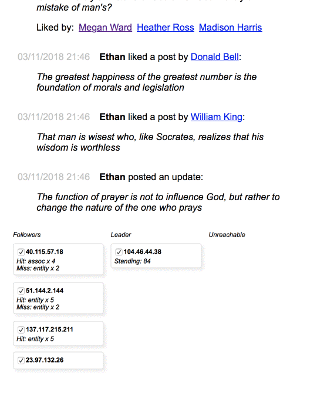

It's:

* A little demo of a social graph - entites (`user`, `status`) and associations (`friend`, `likes`, `likedby`), both of which can have key-value properties.
* MySQL data layer at the bottom
* A graph service, `GraphServer`, implemented as a cluster of nodes that elect a leader with the relevant parts of the [Raft Consensus Algorithm](https://raft.github.io). They are deployed as container instances and use a Redis instance to get their static configuration.
* Live monitoring of the state of the cluster via websocket - the UI (above) shows the navigable social graph and also the current arrangement of nodes and what they're up to. Every so often a Raft heartbeat goes awry and they rearrange themselves. You can simulate partitions by unchecking a node to "unplug" it (it will neither send nor receive heartbeats until you plug it back in).
* Separation of responsibilities between reads and writers: the leader node handles writes, the followers handle reads. All nodes have internal memory caches. When a follower has a chache miss it fills it from the leader. When the leader has a miss it contacts the database. Consequently only the leader ever talks to the database and the followers act as accumulated replicas.
* A bot that calls the write API (so contacting the leader) to generate fake user write activity.

## Still thinking about...

* Updates - that is, modifications to existing entities. These are done at the leader. The leader then needs to notify all followers to invalidate any cache entry. It could achieve consistency by waiting for followers to acknowledge before returning to the writing client. But followers may be unavailable temporarily, in which case after a timeout the leader should rely on queued notifications that it retries (in the heartbeat payload, like Raft) until they are acknowledged, and in the meantime there is a risk of nodes returning stale data. C'est la CAP.
* Failover to a new leader in the face of such updates: any queued notifications need to be persisted so a new leader can resume responsibility for notifying followers of cache invalidations. (If they are pure invalidations then priority is not an issue.)

## Config

`instaface-graphserver` needs a MySQL connection string in an environment variable, e.g.:

```
docker run -p 6542:80 -it danielearwicker/instaface-graphserver -e ConnectionStrings:DefaultConnection="s
erver=192.168.1.170;port=3307;database=instaface1;user=root;password=notverysecret123"
```

The database doesn't have to exist - on startup it checks for it and creates it if necessary (and the tables).

May need to create a user in MySQL tied to the client's IP address and grant it access:

```sql
CREATE USER 'bob'@'192.168.1.160' IDENTIFIED BY 'password123';
GRANT SELECT, INSERT, UPDATE, DELETE on instaface1.* to 'bob'@'192.168.1.160';
FLUSH PRIVILEGES;
```

## MySQL Replication

Haven't used replication in my test setup, but you can get a MySQL instance enabled for replication in Docker with:

```
docker run -p 3361:3306 --name mysqlD -e MYSQL_ROOT_PASSWORD=P@ssw0rd -d mysql:latest --server-id=3361 --gtid-mode=ON --enforce-gtid-consistency=TRUE
```

You can start a second instance running on another port and with another server-id (for no particular reason I've used the same value for both options).

Then in one of them (say, 3361) issue the commands:

```
CHANGE MASTER TO
  MASTER_HOST = '<your-ip-address>',
  MASTER_PORT = 3362,
  MASTER_USER = 'root',
  MASTER_PASSWORD = 'P@ssw0rd',
  MASTER_AUTO_POSITION = 1;

START SLAVE;  
```

Note the port is of the other instance, which will be the master. On the slave you can say:

```  
SHOW SLAVE STATUS;
```

to see if anything is erroring.

On the other instance, run:

```
SHOW SLAVE HOSTS
```

and you should eventually see the slave instance listed.

At this point, any changes you make at the master should automatically appear at the slave.

## Raft implementation

All in `Instaface.Consensus`. Interesting thing (to me) is that I found it easiest to use something akin to Actor pattern. In each of the three modes (follower, candidate, leader) we poll repeatedly for new events on multiple sources, much like a [single-threaded socket server](https://daniel.haxx.se/docs/poll-vs-select.html) using `select` or `poll`.

Events are represented by `Task<T>` so can do a one-time transition to the completed state. We can easily wait for one event of several to occur. Consequently incoming heartbeats are best handled by queuing them and providing a way to get a `Task` that completes as soon as a heartbeat is available in the queue.

So the state machine is blissfully protected from rude interrupts etc. It just cycles away and waits efficiently when nothing is happening.
